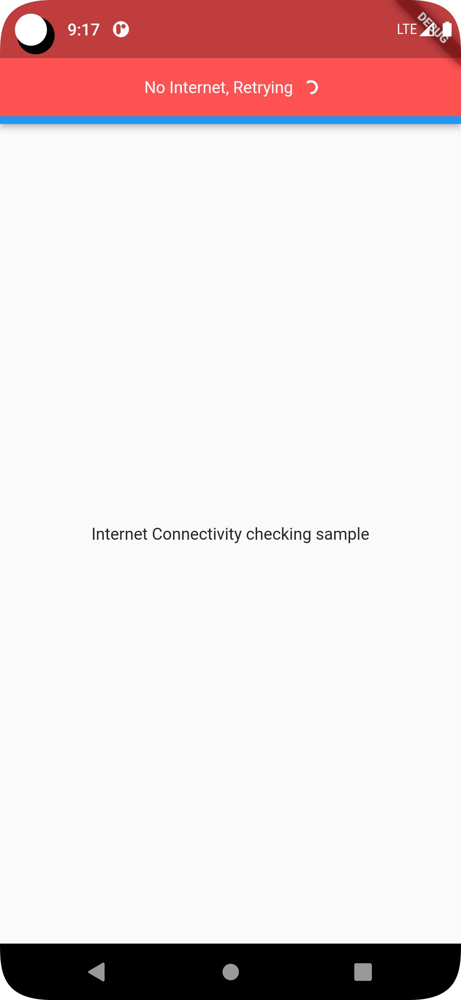
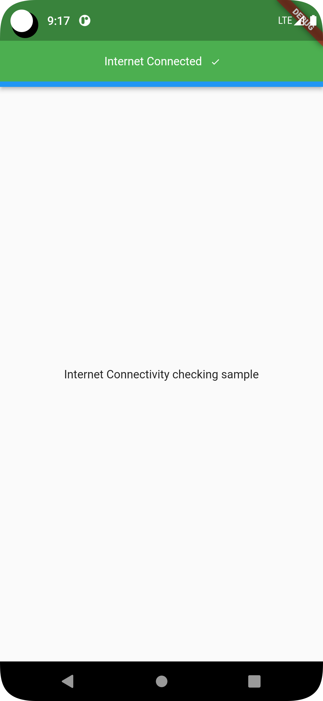

# internet_monitoring
Flutter app internet monitorning examples. 

## FrameWork
1. Flutter

## Language:
1. Dart

## Tools:
1. Git
2. Android studio / Vscode

## Pre-requirement:
1. Flutter 3.3.10
2. Dart 2.18.6
5. connection_notifier: ^1.0.1

# Cli command
## check your flutter support info:

```
flutter doctor
```
## dependancy install / package install:
```
flutter pub get
```
## Run methods:
```
flutter run
```
### ✌&ensp;Preview

|              Image Preview              |                  Gif Preview                   |
|:---------------------------------------:|:----------------------------------------------:|
|  |  |
